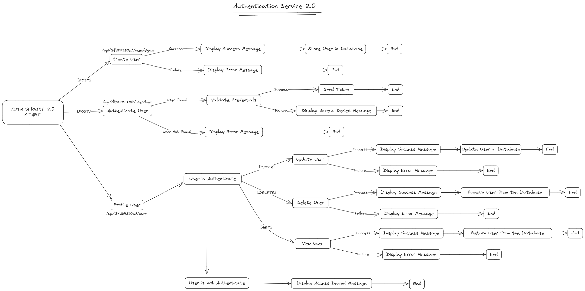

# **Auth Service V2.0**

### API Link 
[https://auth-service.4.us-1.fl0.io/](https://auth-service.4.us-1.fl0.io/)

## Commands:
```
npm run start
```
```
npm run start:dev
```
```
npm run lint
```
```
npm run build
```
<br />

## Routes:
 - /api/{VERSION}/user
 - /api/{VERSION}/user/signup
 - /api/{VERSION}/user/login

<br />

## Methods:
 - **[GET]**, **[PATCH]**, **[DELETE]**: */api/{VERSION}/user*
 - **[POST]**: */api/{VERSION}/user/signup*
 - **[POST]**: */api/{VERSION}/user/login*

<br />

### User:
```typescript
interface User {
  username: string;
  email: string;
  password: string;
}
```

### System Design:


<br />

### **Author**: <a href="https://www.linkedin.com/in/laureano-vera-320086204/" target="_blank">&copy;VeraLaureano</a>